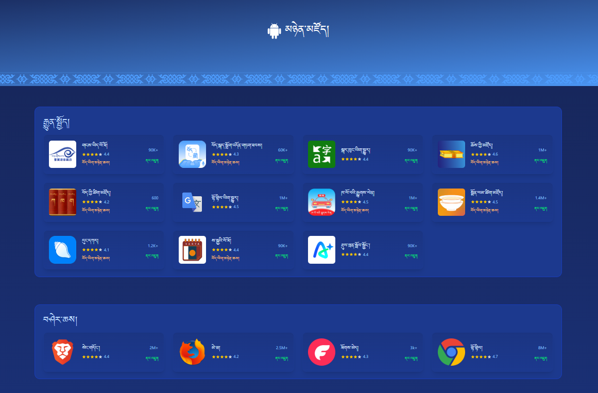

# Nyenzoe (མཉེན་མཛོད།) App Distribution Platform



A modern web application for discovering and distributing privacy-focused and open-source applications. Built with [Astro](https://astro.build/) and [Tailwind CSS](https://tailwindcss.com/), this platform showcases a curated collection of applications across multiple categories.

## 📋 Table of Contents

- [Overview](#overview)
- [Features](#features)
- [Project Structure](#project-structure)
- [Getting Started](#getting-started)
- [Available Commands](#available-commands)
- [Technology Stack](#technology-stack)

## 🌟 Overview

Nyenzoe is an app distribution platform designed to help users discover quality applications focused on privacy, security, and open-source principles. The platform provides an intuitive interface for browsing applications by category with detailed app cards, ratings, and download information.

## ✨ Features

- **Browse Applications**: Discover apps categorized by type (Communication, Browser, VPN, etc.)
- **App Details**: View comprehensive information including author, country of origin, ratings, and downloads
- **Responsive Design**: Fully responsive layout that works seamlessly on desktop, tablet, and mobile devices
- **Modern UI**: Built with Tailwind CSS for a clean, modern, and professional appearance
- **Fast Performance**: Built with Astro for optimal performance and minimal JavaScript
- **Mobile Navigation**: Smart mobile menu for easy navigation on smaller screens

## 🚀 Project Structure

```
Nyenzoe-App Distribution Platform/
├── public/                          # Static assets served directly
│   ├── app/                        # Application-related public assets
│   └── icons/
│       └── thumbnails/             # App icon thumbnails
├── src/                            # Source code
│   ├── assets/
│   │   └── data.json              # Application database with metadata
│   ├── components/                # Reusable Astro components
│   │   ├── Card.astro             # Individual app card component
│   │   ├── CardThumbnail.astro    # App thumbnail display
│   │   ├── EditorsChoice.astro    # Featured/editor's choice section
│   │   ├── Hero.astro             # Hero section component
│   │   ├── Hero2.astro            # Alternative hero component
│   │   ├── Popup.astro            # Popup/modal component
│   │   └── Base/                  # Base layout components
│   │       ├── Footer.astro       # Footer component
│   │       ├── Metainfo.astro     # Meta information (SEO, head tags)
│   │       └── Navbar.astro       # Navigation bar component
│   ├── layouts/
│   │   └── Layout.astro           # Main layout template
│   ├── lib/
│   │   └── strapi.ts              # Strapi CMS integration library
│   ├── pages/
│   │   ├── index.astro            # Main landing page
│   │   ├── index2.astro           # Alternative page version
│   │   ├── index-backup.astro     # Backup page version
│   │   └── index-strapi.astro     # Strapi-integrated page
│   └── styles/
│       └── global.css             # Global styles
├── .vscode/                        # VS Code configuration
│   ├── extensions.json            # Recommended extensions
│   └── launch.json                # Debug configuration
├── .gitignore                      # Git ignore rules
├── astro.config.mjs               # Astro configuration with Tailwind
├── package.json                   # Project dependencies
├── pnpm-lock.yaml                # Dependency lock file
├── tsconfig.json                  # TypeScript configuration
└── README.md                      # This file
```

## 🎯 Key Components

### Pages
- **index.astro**: Main landing page displaying the app distribution platform with all applications

### Components
- **Card.astro**: Displays individual application cards with title, author, icon, rating, and download information
- **Hero2.astro**: Hero section for the landing page with branding and navigation
- **Popup.astro**: Modal component for displaying additional app information
- **Navbar/Footer**: Navigation and footer components for consistent layout
- **Metainfo.astro**: Handles meta tags for SEO and social sharing

### Data
- **data.json**: Central database containing all application metadata including title, category, author, country, icon, and description

## 🛠️ Getting Started

### Prerequisites
- Node.js (v18 or higher)
- pnpm (recommended) or npm

### Installation

1. Clone the repository:
```bash
git clone <repository-url>
cd "Nyenzoe-App Distribution Platform"
```

2. Install dependencies:
```bash
pnpm install
# or
npm install
```

3. Start the development server:
```bash
pnpm run dev
# or
npm run dev
```

4. Open your browser and navigate to `http://localhost:3000`

## 📦 Available Commands

| Command | Description |
|---------|-------------|
| `pnpm run dev` | Start local development server at `localhost:3000` |
| `pnpm run build` | Build production site to `./dist/` folder |
| `pnpm run preview` | Preview the production build locally |
| `pnpm run astro` | Run Astro CLI commands directly |
| `pnpm run astro -- --help` | Get help with Astro CLI options |

## 🛠️ Technology Stack

- **Astro 5.13.5**: Modern static site generator with minimal JavaScript
- **Tailwind CSS 4.1.13**: Utility-first CSS framework for styling
- **@tailwindcss/vite 4.1.13**: Vite plugin for Tailwind CSS integration
- **TypeScript**: For type-safe development
- **Strapi**: CMS integration for content management (via `lib/strapi.ts`)

## 📝 Project Notes

- Multiple page versions (index, index2, index-backup, index-strapi) suggest different design iterations or CMS integration approaches
- App data is currently stored in `data.json` but can be integrated with Strapi CMS using the provided Strapi library
- Mobile menu functionality is implemented via JavaScript for responsive navigation
- The project uses a blue gradient theme for visual branding
- The platform currently features various categories including:
  - Communication (Signal, Zom)
  - Browsers (Brave, Firefox)
  - VPN (Psiphon, Tor Browser)
  - And more

## 🚀 Deployment

Build the project:
```bash
pnpm run build
```

The `./dist/` folder contains the static build ready for deployment to any static hosting service (Vercel, Netlify, GitHub Pages, etc.).

## 📞 Support

For more information about Astro, visit [Astro Documentation](https://docs.astro.build)

For Tailwind CSS help, check [Tailwind CSS Documentation](https://tailwindcss.com/docs)
